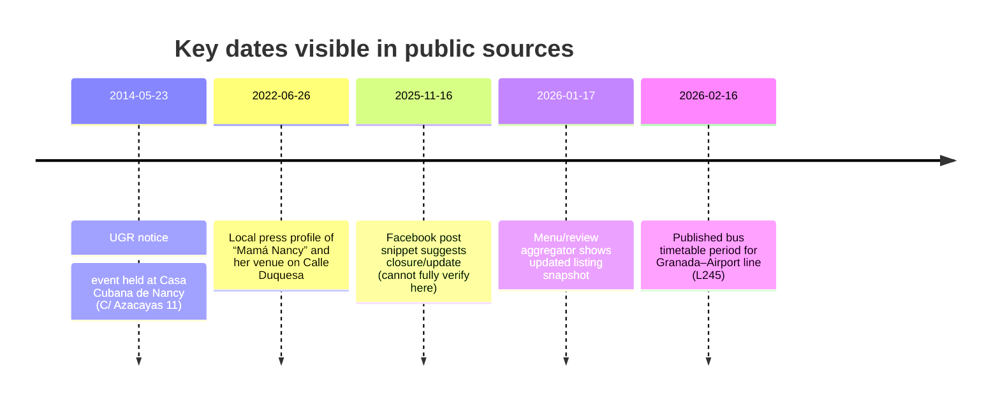

# Mama Nancy in Granada, Casa Cubana

## Executive summary

entity["restaurant","La Casita Cubana de Mama Nancy","granada, andalusia, es"] is consistently described in authoritative local directories and local press as a **Cuban-themed tapas/cocktail bar** in central Granada (Spain), not as an accommodation property. Its most consistently reported current location is **Calle Duquesa 31, Centro, 18001 Granada**, near the Faculty/Law Library area, with typical hours **12:00–00:00 daily**. citeturn8view0turn3view3turn28search4turn7search0turn3view2

A substantial source discrepancy exists because some web footprints (notably a Facebook page that is difficult to access directly in this environment) appear to mix **Granada (Spain) bar identity** with **Havana (Cuba) “Casa Cubana Mama Nancy” lodging identity**, and one channel labels the entity as a “hostal” while still showing Spanish phone codes. This creates a high risk of travelers confusing two different businesses that share a similar name. citeturn17search0turn12search1turn11view0turn7search0

Review access for the **last 2 years (2024–2026)** is incomplete: reliable, dated review text from major platforms (especially Google Maps) could not be fully retrieved here due to platform throttling/limitations. However, multiple aggregators indicate **strong overall satisfaction** (example: **4.7/5 from 77 evaluations**, updated Jan 2026), and older dated reviews (2022) emphasize hospitality and mojitos. citeturn22view1turn11view0

## Identity, naming variants, and location

### Exact name(s) and observed variants

Across Spanish-language and platform sources, the following naming variants refer to the **same Granada venue** (high-confidence match, because they converge on Calle Duquesa 31):

- **“La Casita Cubana de Mama Nancy”** (dominant directory form). citeturn8view0turn3view3turn28search4  
- **“Casa Cubana de Nancy”** (used by restaurant directories). citeturn11view0  
- **“La Casa Cubana de Nancy”** (older/guide-style references). citeturn11view1  
- **“Casa Cubana Mamá Nancy”** (Instagram display name / handle). citeturn7search0turn17search11  

A historically important **prior address** appears repeatedly in older sources:

- **Calle Azacayas 11, Granada** (seen in a 2014 University of Granada notice and older student/travel content), implying a **past location** or earlier iteration of the business. citeturn11view2turn11view1turn11view0  

### Current address and map point

**Current address (most consistent across high-credibility sources):**  
Calle Duquesa, 31, Centro, 18001 Granada, Spain. citeturn8view0turn3view3turn28search4turn7search0  

**Coordinates shown by a major Spanish directory listing:**  
37.1786553, -3.6031193. citeturn8view0  

**Map link (coordinate-based):**
```text
https://www.google.com/maps?q=37.1786553,-3.6031193
```
(Uses the coordinates published in a directory listing.) citeturn8view0  

image_group{"layout":"carousel","aspect_ratio":"16:9","query":["Calle Duquesa 31 18001 Granada map","La Casita Cubana de Mama Nancy Granada","Casa Cubana de Nancy Granada mojitos","La Casita Cubana de Mama Nancy interior"],"num_per_query":1}

## Contact channels, hours, booking, and amenities

### Contact details

**Phone (primary, most consistent across Spanish directories):**  
+34 634 08 07 99. citeturn8view0turn3view3turn28search4  

**Phone (secondary / discrepancy):**  
+34 653 23 84 30 appears as a “contact/reserve” number on one restaurant directory and is also surfaced in a Facebook snippet; it may be an alternate mobile, a call-forwarding number, or outdated. Treat as **unverified secondary** unless confirmed by the venue. citeturn11view0turn12search1  

**Email:**  
- Likely email found only via a Facebook snippet: `mamanancycuba@gmail.com` (cannot fully verify here due to access limits; treat as **tentative**). citeturn12search1  
- A directory lists an email formatted as `[email protected]`, which is strongly suggestive of a **placeholder** rather than a real inbox → treat as **not reliable**. citeturn3view3  
**Conclusion:** email is effectively **unspecified (not reliably verified)**.

**Website:**  
No standalone official website was found in accessible sources; presence appears to rely primarily on social platforms and directory listings. citeturn8view0turn7search0  

### Social media links

```text
Instagram (venue): https://www.instagram.com/cafebarmamanancy/
Facebook (page):  https://www.facebook.com/casacubanadenancy/
Instagram (owner/persona, unverified link to venue): https://www.instagram.com/mamanancyvida/
```

Instagram’s profile snippet explicitly states the Duquesa 31 address and identifies the venue as a Cuban café/bar in Granada. citeturn7search0turn17search11  
The same Facebook page URL is referenced by Spanish directories, but its internal “About” fields appear inconsistent across scraped snippets (see discrepancies section). citeturn8view0turn12search1  

### Opening hours

The most consistent schedule across Spanish directory sources is:

- **Daily:** 12:00–00:00 (midnight). citeturn8view0turn3view3turn28search4  

Because directories can lag reality, treat the above as **typical hours** and consider confirming by phone before a late visit. citeturn8view0turn28search4  

### Amenities and offering

Sources repeatedly characterize the venue as:

- a **tapas bar** with **Cuban dishes** and **tropical cocktails**, citeturn8view0turn3view3  
- with special emphasis on **mojitos** and **piña colada**, citeturn8view0turn3view3turn3view2  
- in a **central** location near the **Faculty of Law/Law Library** area. citeturn8view0turn3view3turn7search0  

### Booking options

For a bar/tapas venue, “booking” typically means **table reservation**:

- **Phone reservation** via the published number(s). citeturn8view0turn11view0  
- A restaurant directory provides a **“Reservar”** call-to-reserve flow (likely via phone). citeturn11view0  

**Cancellation policy:** unspecified (no clearly published reservation terms found).  
**Check-in / check-out:** not applicable (this is not an accommodation listing in Granada).

### Room types and rates

**Room types:** not applicable in Granada (the entity is presented as a bar/tapas venue, not lodging). citeturn8view0turn3view3turn3view2  
**Room rates:** not applicable in Granada.

**Typical pricing (food/drinks):** current menu pricing is **unspecified** in sources accessible here. Older traveler/student content (pre-2026) mentions cocktails priced very low (e.g., “less than three euros”), but this should be treated as **historical** and not relied upon for current budgeting. citeturn11view1  

## Photos and visual references

A minimum of three publicly accessible photo links are available via an older venue feature page (likely reflecting the earlier “Casa Cubana de Nancy” iteration). These are useful for ambiance but may not perfectly match the current interior.

```text
Photo 1: https://d1bvpoagx8hqbg.cloudfront.net/originals/uno-de-mejores-rincones-secretos-de-granada-ef0c14591e6c76802c9ca024622dcfbd.jpg
Photo 2: https://d1bvpoagx8hqbg.cloudfront.net/originals/uno-de-mejores-rincones-secretos-de-granada-d281ba78a4dcb430e01abb71c742019b.jpg
Photo 3: https://d1bvpoagx8hqbg.cloudfront.net/originals/uno-de-mejores-rincones-secretos-de-granada-f575ee144711aa09ef447b6a6e96887c.jpg
```

These images originate from a “La Casa cubana de nancy” feature page, which also lists the historic Azacayas 11 address. citeturn11view1turn32view0turn32view1turn32view2  

A directory listing also contains a themed image associated with the venue. citeturn33view1  

## Reviews, cleanliness, and safety signals

### Ratings snapshot

Because full Google Maps review text could not be retrieved reliably here, the best available quantitative “reputation snapshot” comes from third-party aggregators:

- **4.7/5 from 77 evaluations** (updated Jan 17, 2026) on a menu/review aggregator. This is a useful directional indicator, but not a primary review platform. citeturn22view1  
- Another directory reports **4.4** based on **19 valuations** and shows several short reviews dated May 2022. citeturn11view0  

### Recent guest reviews summary for the last two years

**Status: partially unspecified (data access constraint).**  
No reliably accessible, dated review corpus from 2024–2026 (Google Maps or TripAdvisor restaurant pages) could be gathered in this environment. The most recent dated review snippets retrieved were from **2022**. citeturn11view0  

**Representative guest sentiment from accessible review snippets (older, May 2022):**
- Guests praise mojitos/cocktails and note warm hospitality, e.g., “Los mejores mojitos y cócteles…” and “Ambiente cubano excepcional.” citeturn11view0  
- Multiple reviews emphasize Nancy’s welcoming presence, e.g., “Nancy es un encanto!” citeturn11view0  

### Cleanliness and safety notes

- **Cleanliness:** No consistent, recent cleanliness complaints were found in accessible sources; specific cleanliness verification is **unspecified**, because the accessible dated review set is limited and older. citeturn11view0  
- **Safety:** No venue-specific safety warnings were found in the accessible corpus; as a centrally located venue near major landmarks, standard city-center awareness applies. Central proximity is supported by landmark distances. citeturn8view0  

### Accessibility

Venue-level accessibility details (step-free entry, accessible toilets) are **unspecified** in accessible listings.

Accessibility-related information **is** available for airport-to-city transport (bus assistance for reduced mobility requires advance coordination in one guide), but that concerns transit rather than the venue itself. citeturn36view2  

## Nearby landmarks, transport, and directions

### Nearby landmarks and estimated walking times

A major Spanish directory lists approximate distances to key landmarks:

- entity["point_of_interest","Catedral de Granada","cathedral granada, es"]: **420 m** (~5–6 min walk). citeturn8view0  
- entity["point_of_interest","Capilla Real de Granada","royal chapel granada, es"]: **446 m** (~6 min walk). citeturn8view0  
- entity["point_of_interest","Calle de las Teterías","tea street granada, es"]: **551 m** (~7–8 min walk). citeturn8view0  

Transport-oriented proximity from an aggregator:

- entity["point_of_interest","Estación de Granada","rail station granada, es"]: **945 m** (about ~12 min walk; estimate). citeturn22view1  
- entity["local_business","Parking San Agustín","granada, andalusia, es"]: **237 m** (~3 min walk; estimate). citeturn22view1  

(Walking times assume typical pedestrian pace; distances are sourced, times are estimates.)

### Directions from Granada city center

Using Granada Cathedral (a practical “city center” proxy due to its central placement and explicit distance listing):

1. Walk from **Catedral de Granada** toward the Centro area around Calle Duquesa.  
2. Total distance is ~420 m per directory listing (roughly 5–6 minutes). citeturn8view0  

### Directions from Granada Airport

The relevant airport is entity["point_of_interest","Federico García Lorca Granada-Jaén Airport","granada, spain airport"] (GRX). citeturn27view0turn24search3  

**By bus (public transport, recommended for most visitors):**  
Official airport guidance states a Granada–Airport bus line connects the airport to the city center (~17 km) with strategic central stops including Gran Vía de Colón and the area near the Congress Palace, taking about ~45 minutes end-to-end. citeturn27view0  

The Granada tourism site (city tourism portal) provides additional operational detail for the same service (commonly referenced as **L245**), including stop lists and a fare reference. It lists central stops such as **Gran Vía (Catedral)** and **Puerta Real (Acera del Darro)**, and notes the fare was **€3 as of 31/05/2022** (fare may have changed). citeturn36view2  

**Practical route to the venue:**
1. From GRX arrivals, take bus **L245 / “Aeropuerto Granada”** toward the city. citeturn36view2turn27view0  
2. Get off at **Gran Vía (Catedral)** (commonly listed stop). citeturn36view2  
3. Walk ~420 m to Calle Duquesa 31 (about 5–6 minutes). citeturn8view0  

**Bus timetable examples (showing service exists; schedules vary):**  
A published timetable for Feb 16–22, 2026 shows multiple daily departures between **Palacio de Congresos** and the Airport in both directions. citeturn25view0turn26view0  

**By taxi / car:**  
Road distance between GRX and Granada is commonly reported around **~17 km** (example road distance figure 17.2 km in a routing aggregator). citeturn24search3  

## Background, authenticity, and discrepancies

### Short history and background

Local press portrays Mamá Nancy as a Cuban-born hospitality figure whose venue serves as a kind of “Cuban corner” in Granada, emphasizing her personality, décor, and especially mojitos; the article situates her place on Calle Duquesa and notes her long experience in hospitality, including having opened the first “Casa Cubana” in the city (no founding year stated). citeturn3view2  

A University of Granada notice documents an event held at “Casa Cubana de Nancy” at **C/ Azacayas 11** in May 2014, confirming the venue (or its earlier incarnation) has been present in Granada’s social/cultural orbit since at least 2014. citeturn11view2  

A restaurant directory explicitly reflects a **transition** by describing the venue’s “origin” at Azacayas 11 while listing the current address as Duquesa 31, supporting the hypothesis of a relocation rather than two separate Granada venues. citeturn11view0  

### Owner / contact person

The owner/host figure is consistently “Nancy” (popularly “Mamá Nancy”) in narrative descriptions and reviews. citeturn3view2turn11view0  
A related Instagram presence names **entity["people","Nancy María Colomé Capote","granada cuba culinary persona"]**; the relationship to the Calle Duquesa venue is plausible but not fully verifiable here due to social-platform access limits. citeturn12search3turn7search0  

### Authenticity verification and discrepancy notes

**High-confidence facts (strong multi-source agreement):**
- The venue exists (or recently existed) at **Calle Duquesa 31, 18001 Granada**. citeturn8view0turn3view3turn7search0turn28search4  
- The venue is a **tapas/cocktail bar** emphasizing Cuban food and mojitos. citeturn8view0turn3view3turn3view2  
- Typical hours reported as **12:00–00:00 daily**. citeturn8view0turn3view3turn28search4  

**Material discrepancies (need traveler caution):**
- **Address history:** credible sources show **Azacayas 11** (2014) vs **Duquesa 31** (current). This is best explained as **relocation**, not necessarily two Granada venues. citeturn11view2turn11view1turn11view0turn8view0  
- **Phone numbers:** +34 634 08 07 99 vs +34 653 23 84 30. The second may be a directory routing number or outdated; confirm by cross-checking via Instagram or calling both. citeturn8view0turn28search4turn11view0turn12search1  
- **Category/location contamination:**  
  - A TripAdvisor hotel listing exists for **“Casa Cubana Mama Nancy” in Havana (Cuba)**—a lodging property with rooms—separate from the Granada bar. citeturn17search0  
  - A Facebook snippet for “La Casa Cubana de Nancy” appears to describe a “hostal” and references Havana while still showing a Spanish phone code; this strongly suggests the Facebook presence (or scraping thereof) is **internally inconsistent** and may conflate entities. citeturn12search1turn17search0  

### Mermaid timeline of key dates



Sources for timeline items: University notice (2014), local press (2022), Facebook snippet (2025), aggregator update (2026), and CTAGR/Airport bus materials (2026). citeturn11view2turn3view2turn28search5turn22view1turn25view0  

## Source comparison table

| Source | URL | Date accessed | Key data points captured |
|---|---:|---:|---|
| entity["company","Páginas Amarillas","spain business directory"] listing | `https://www.paginasamarillas.es/f/granada/la-casita-cubana-de-mama-nancy_310032784_000000001.html` | 2026-03-08 | Phone 634080799; address Duquesa 31; hours 12:00–00:00; coordinates; nearby landmark distances; social links. citeturn8view0 |
| entity["company","Cylex","business directory"] listing | `https://www.cylex.es/granada/la-casita-cubana-de-mama-nancy-14528883.html` | 2026-03-08 | Address Duquesa 31; phone 634 08 07 99; hours 12:00–24:00; describes tapas + Cuban cocktails; lists placeholder-like email format. citeturn3view3 |
| entity["company","Firmania","business directory"] listing | `https://firmania.es/granada/la-casita-cubana-de-mama-nancy-2611583` | 2026-03-08 | Confirms address Duquesa 31; phone +34 634 08 07 99; hours 12:00–00:00; update stamp 15.02.2026. citeturn28search4 |
| entity["company","Instagram","social media platform"] profile snippet | `https://www.instagram.com/cafebarmamanancy/` | 2026-03-08 | Calls it “Café Bar cubano en Granada”; explicitly states “C/ Duquesa 31, 18001”. citeturn7search0turn17search11 |
| entity["company","PideMesa","restaurant directory spain"] listing | `https://pidemesa.es/restaurantes/granada/granada/casa-cubana-de-nancy` | 2026-03-08 | Mixed address history (Azacayas 11 origin vs Duquesa 31 current); phone 653 23 84 30; dated reviews shown (May 2022). citeturn11view0 |
| entity["organization","Universidad de Granada","public university spain"] notice | `https://secretariageneral.ugr.es/informacion/noticias/segunda-edicion-de-tapas-con-ciencia` | 2026-03-08 | Documents Casa Cubana de Nancy at C/ Azacayas 11 in 2014 (historical anchor). citeturn11view2 |
| entity["organization","Granada Hoy","local newspaper granada"] article | `https://www.granadahoy.com/opinion/articulos/Mama-Nancy_0_1696330460.html` | 2026-03-08 | Profile of Mamá Nancy; locates her venue on Calle Duquesa; emphasizes mojitos and cultural ambiance; implies long-running Granada hospitality presence. citeturn3view2 |
| entity["company","Aena","spanish airport operator"] airport page | `https://www.aena.es/en/f.g.l.-granada-jaen/how-to-get-there/bus.html` | 2026-03-08 | Airport bus description: 17 km to city center; ~45 min trip; key stops; contact phone; links to schedules/fares. citeturn27view0 |
| Junta/CTAGR bus timetable PDF (Line 245) | `https://ctagr.es/wp-content/uploads/horarios/20260216/L0245.pdf` | 2026-03-08 | Concrete service schedule example (week of Feb 16–22, 2026), both directions. citeturn25view0turn26view0 |
| Granada tourism portal (Ayuntamiento) | `https://turismo.granada.org/es/como-venir-delir-al-aeropuerto-granada` | 2026-03-08 | Line 245 operational notes; stop list (incl. Gran Vía/Catedral); fare reference (€3 as of 2022); trip duration range. citeturn36view2 |

